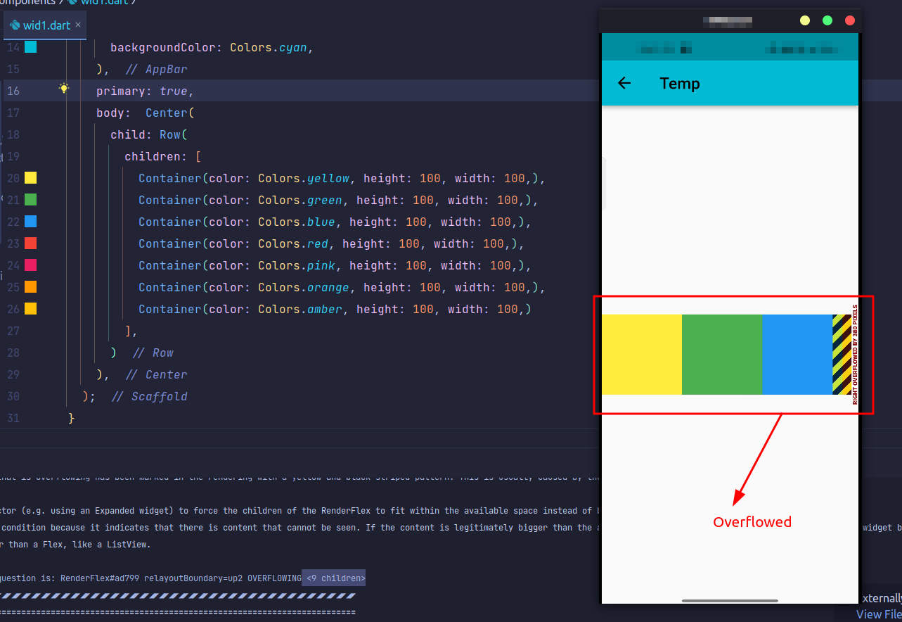
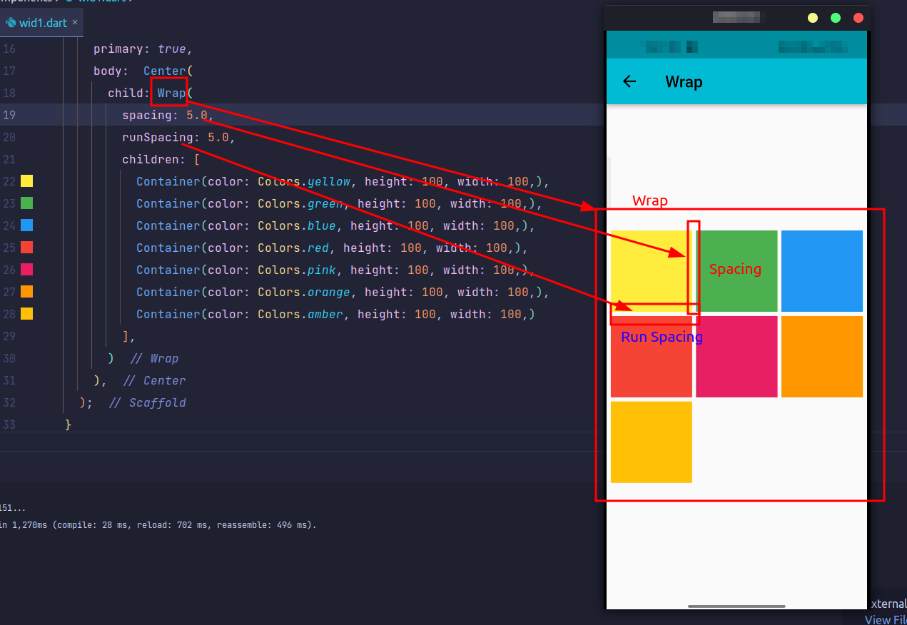

<p align="center"></a></p>

## Here are some awesome Flutter widgets

#### Table of the content 📑
1. Image Color Filter 
2. Flip Card Widget
3. Image Viewer 3D
4. Interactive Viewer Widget
5. Reorderable List View Widget
6. Cupertino Context Menu Widget
7. Tabular View Widget
8. Amazon 'Swipe to place your order' UI
9. Stepper Widget
10. Confetti Widget 
11. List Wheel Scroll View Widget

### Awesome Widget's Preview 😎

<table>
    <tr>
    <td align="center">Image Color Filter</td>
    <td align="center">FlipCard</td>
    <td align="center">Image Viewer 3D</td>
    </tr>
    <tr>
    <td></td>    
    <td></td>
    <td></td>
    </tr>
    <tr>
    <td align="center">Interactive Viewer</td>
    <td align="center">Re-orderable List View</td>
    <td align="center">Cupertino Context Menu</td>
    </tr>
    <tr>
    <td></td>
    <td></td>
    <td></td>
    </tr>
    <tr>
    <td align="center">Tabular View</td>
    <td align="center">Swipe to place order</td>
    <td align="center">Stepper</td>
    </tr>
    <tr>
    <td></td>
    <td></td>
    <td></td>
    </tr>
    <tr>
    <td align="center">Confetti</td>
    <td align="center">List Wheel Scroll View</td>
    <td align="center"></td>
    </tr>
    <tr>
    <td></td>
    <td></td>
    </tr>
</table>

## Overflow
### 1. Wanna get rid of Widgets Overflowed while placing them in a Row ?


<details><summary>Solution</summary>
<p>

### Just Wrap them 😎


**Use**
```dart
Wrap(
    spacing: 5.0,
    runSpacing: 5.0,
    children: [
        Container(color: Colors.yellow, height: 100, width: 100,),
        Container(color: Colors.green, height: 100, width: 100,),
        Container(color: Colors.blue, height: 100, width: 100,),
        Container(color: Colors.red, height: 100, width: 100,),
        Container(color: Colors.pink, height: 100, width: 100,),
        Container(color: Colors.orange, height: 100, width: 100,),
        Container(color: Colors.amber, height: 100, width: 100,)
    ],
)
```
</p>
</details>


## Looking to contribute 📝 ?
Please read [CONTRIBUTING.md](/CONTRIBUTING.md) before writing a pull request.


*<p align="center">Show some support by **⭐ing** this repository 😇</p>*

**<p align="center">Happy Coding 😎</p>**